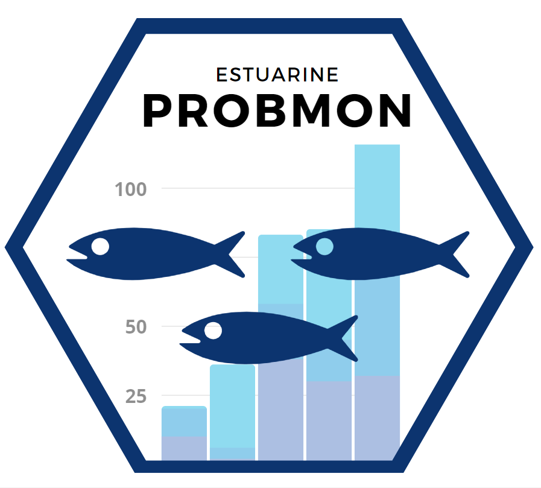

<!-- README.md is generated from README.Rmd. Please edit that file -->
Estuarine Probabilistic Monitoring 
============================================================================================================================================================================================================================================

Overview
--------

Processes used by Virginia Department of Environmental Quality to assess sediment quality in estuarine waters.

Weight of Evidence
------------------

Sediment chemistry, aquatic toxicity testing, and biological condition are the three lines of evidence used to determine the health of sediments pertaining to aquatic life. These three components are known as the Sediment Quality Triad. Every 5 years Virginia's Estuarine Probabilistic Monitoring Program collects additional samples for EPA's [National Coastal Condition Assessment](https://www.epa.gov/national-aquatic-resource-surveys/ncca) which includes fish tissue samples.

Sediment Chemistry
------------------

Toxicity Testing
----------------

Biological Condition
--------------------
